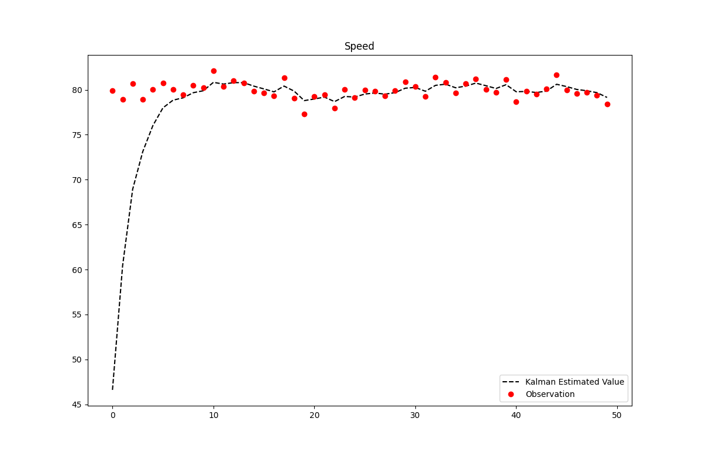
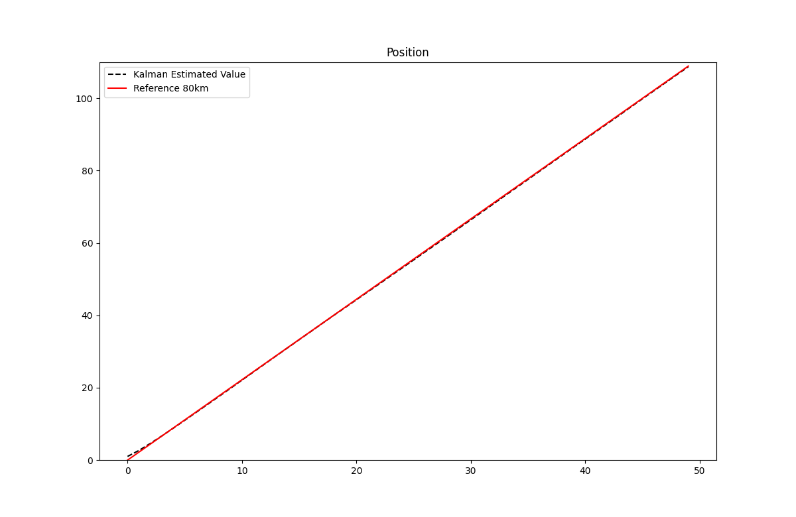

# Kalman

### Objective
Implementing LKF, EKF, UKF, Particle Filter, and other related algorithms.

### To build
python3, matplotlib should be installed (optional: gui - tkinter)

```
$ sudo apt-get install python-tk
$ python3 -m pip install matplotlib

$ git clone https://github.com/anecjong/Kalman.git
$ cd Kalman
$ git submodule update --init --recursive
$ cd build
$ cmake ..
$ make
$ ./main
```

### Images



### Todo
- EKF
- UKF
- Particle Filter

### Reference
- [칼만 필터는 어렵지 않아](https://product.kyobobook.co.kr/detail/S000001743717) 